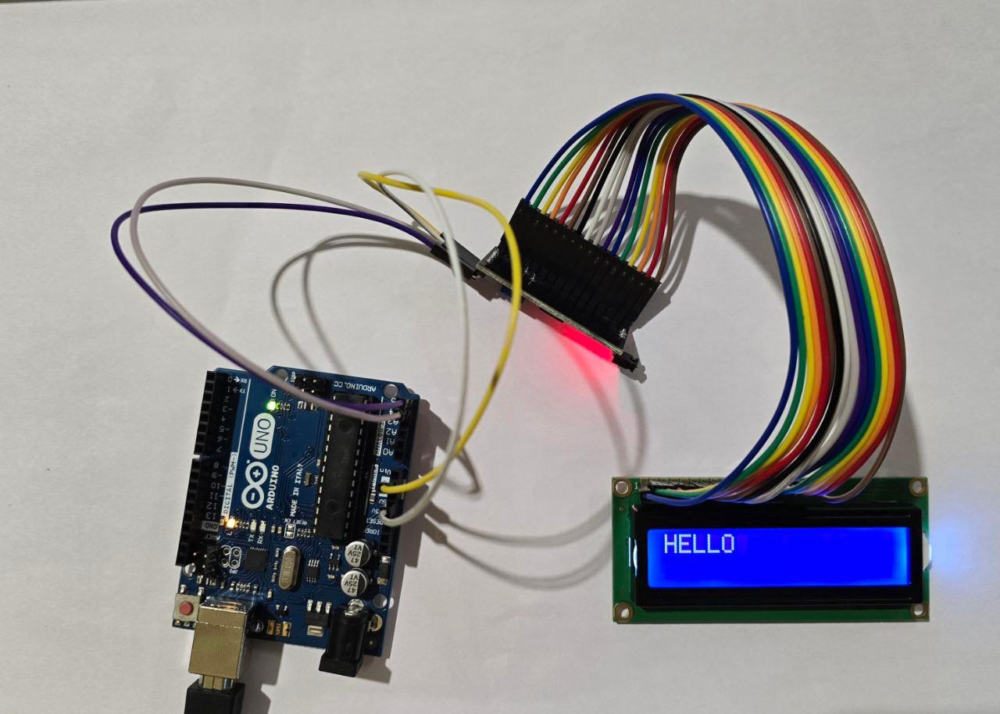
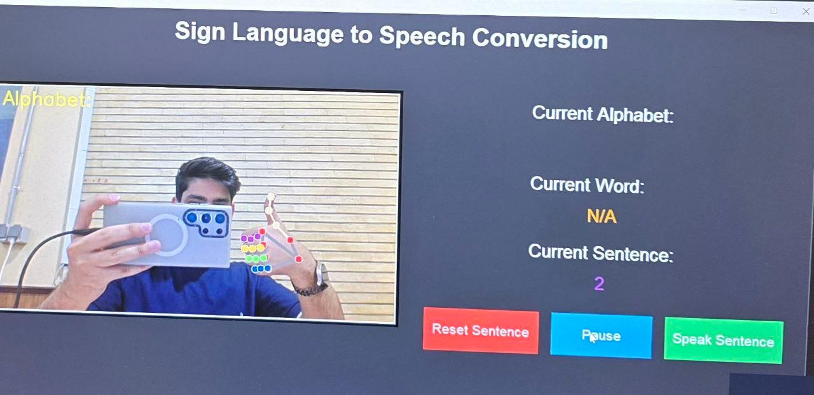

# ASL Recognition with LCD Display

A real-time American Sign Language (ASL) letter recognition system that displays recognized text on a character LCD using computer vision and machine learning.

## Overview

This project combines image processing, machine learning, and embedded systems to create a communication aid. The system captures hand gestures via webcam, processes them using MediaPipe and Random Forest classifier, then displays the recognized letters on an LCD screen via Arduino.

**Note**: The Python computer vision component is based on the [Sign Language to Text and Speech](https://github.com/tanmayJivnani/Sign-Language-to-Text-and-Speech) project by Tanmay Jivnani, adapted for LCD display output via Arduino.

## Hardware Requirements

- Arduino UNO (5V TTL)
- 16x2 LCD with I2C module (address 0x27)
- USB webcam
- USB cable for Arduino connection
- Jumper wires

## Software Requirements

- Python 3.7+
- Arduino IDE
- Required Python libraries:
  - opencv-python
  - mediapipe
  - scikit-learn
  - pyserial
  - numpy

## Installation

### Python Setup
```bash
git clone https://github.com/yourusername/ASL-Recognition-LCD.git
cd ASL-Recognition-LCD
pip install -r requirements.txt
```

### Arduino Setup
1. Install LiquidCrystal_I2C library in Arduino IDE
2. Upload `LCD_I2C.ino` to Arduino UNO

## Wiring



```
Arduino UNO    →    LCD I2C Module
5V             →    VCC
GND            →    GND
A4 (SDA)       →    SDA
A5 (SCL)       →    SCL
```

## Usage

1. Connect hardware according to wiring diagram
2. Update serial port in `main.py`:
   ```python
   ser = serial.Serial('COM3', 9600, timeout=1)  # Windows
   # or
   ser = serial.Serial('/dev/ttyUSB0', 9600, timeout=1)  # Linux
   ```
3. Run the program:
   ```bash
   python main.py
   ```
4. Show ASL letters to the camera
5. Recognized text appears on LCD




**Acknowledgments**: Python computer vision implementation based on [Sign Language to Text and Speech](https://github.com/tanmayJivnani/Sign-Language-to-Text-and-Speech) by Tanmay Jivnani.
